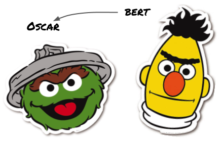

# Oscar: Object-Semantics Aligned Pre-training for Vision-and-Language Tasks     
# VinVL: Revisiting Visual Representations in Vision-Language Models  

Reference: https://github.com/microsoft/Oscar

```
@article{li2020oscar,
  title={Oscar: Object-Semantics Aligned Pre-training for Vision-Language Tasks},
  author={Li, Xiujun and Yin, Xi and Li, Chunyuan and Hu, Xiaowei and Zhang, Pengchuan and Zhang, Lei and Wang, Lijuan and Hu, Houdong and Dong, Li and Wei, Furu and Choi, Yejin and Gao, Jianfeng},
  journal={ECCV 2020},
  year={2020}
}

@article{zhang2021vinvl,
  title={VinVL: Making Visual Representations Matter in Vision-Language Models},
  author={Zhang, Pengchuan and Li, Xiujun and Hu, Xiaowei and Yang, Jianwei and Zhang, Lei and Wang, Lijuan and Choi, Yejin and Gao, Jianfeng},
  journal={CVPR 2021},
  year={2021}
}
```

## Contribution

We add code to the original Oscar repository that (1) trains a distilled version of Oscar where Oscar is the teacher and BERT is the student model (`oscar/run_distillation.py`), and (2) trains a BERT model on Oscar's caption data (`oscar/run_bert_on_captions.py`).


## License
Oscar is released under the MIT license. See [LICENSE](LICENSE) for details. 

